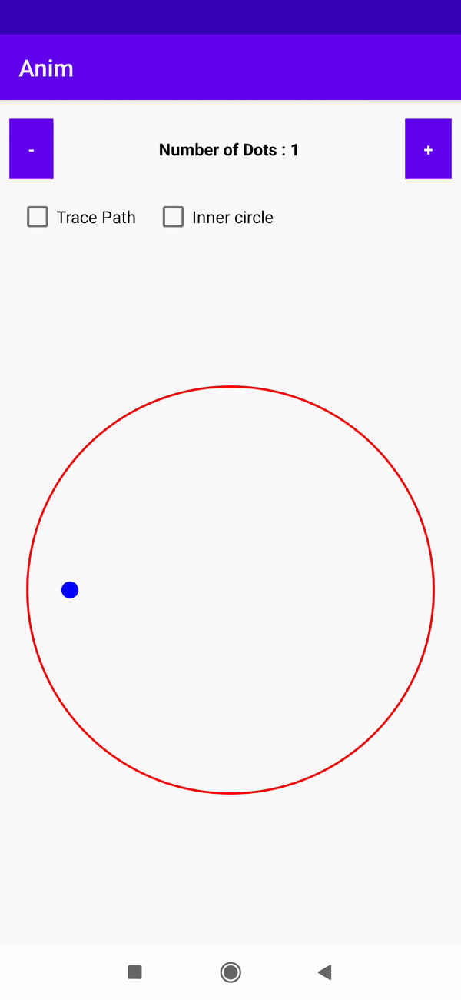
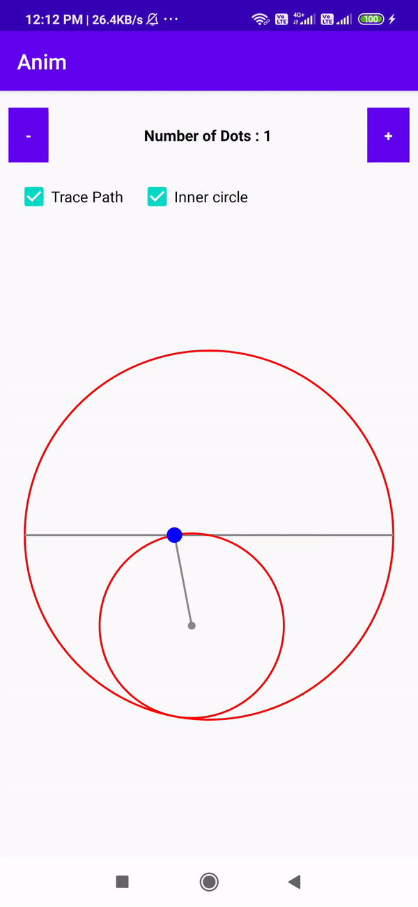

# Tusi-Couple

An animated model of Tusi Couple and the Copernicus' theoram leads to crazy circle illusion

It appears like dots are moving inside as circle and rolling inside larger blue circle, but if we look at the each dot it's moving exactly in a straight line

so why does it look like rolling as circle?
It's copernicus' theoram - If a small circle with radius r/2 is perfectly rolling in a large circle with a radius r, a point on the smaller circle's circumference traces out a straight line segment exactly equal to the larger circle's diameter

In the below image we are rolling small circle whose radius is half of the large circle, as the circle rolls out the blue point on the smaller circle's circumference moves in a straight line

so the dots are rolling only but it traces a straight line
